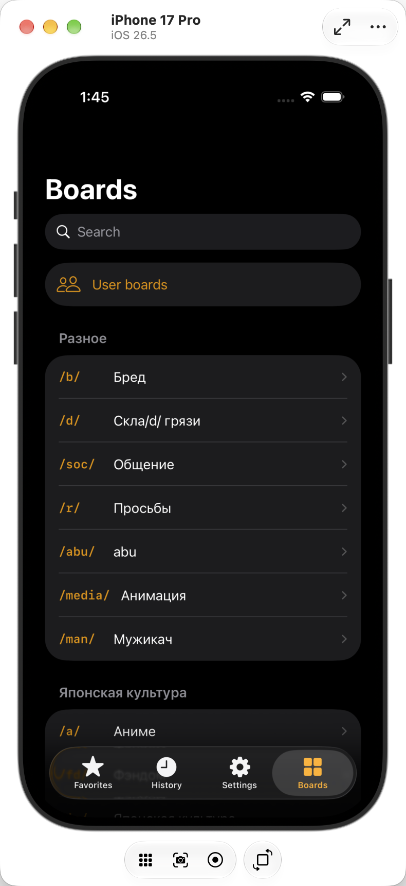

# Neechan

[](https://github.com/leros1337/neechan/actions/workflows/release.yml)
[](LICENSE)

[English](README.md) · **Русский**

Нативный iOS-клиент имиджбордов **2ch** (`2ch.org` / `2ch.life`) и **4chan**,
написанный на Swift 6 и SwiftUI под iOS 26. По возможностям на 2ch ориентируется на
андроид-клиент [DashchanFork](https://github.com/TrixiEther/DashchanFork), а навигация
построена на Liquid Glass.

Неофициальный клиент, никак не связанный ни с одним из сайтов.



## Установка

Скачайте `.ipa` в разделе [Releases](../../releases).

Сборка **неподписанная**: сертификата в репозитории нет и быть не должно. Просто открыть
файл на устройстве не получится — нужен [AltStore](https://altstore.io),
[Sideloadly](https://sideloadly.io) или своя учётная запись разработчика Apple.
Требуется iOS 26 или новее, iPhone или iPad.

## Что умеет

- **Чтение** — доски каталогом или постранично, списком, карточками или сеткой; треды со
  счётчиком ответов, всплывающими цитатами, окном ответов, поиском по треду и
  запоминанием места, на котором вы остановились.
- **Два имиджборда** — переключатель на списке досок выбирает между 2ch и 4chan.
  Избранное, история, скрытые треды и всё остальное принадлежат тому сайту, откуда
  пришли, а вставленная ссылка открывается на том сайте, который в ней назван.
- **Постинг** — на 2ch: ответы и новые треды, панель разметки, оборачивающая
  выделенный текст, черновики, вложения с вырезанными метаданными и случайными именами,
  эмодзи-капча с её вычислительной задачей. 4chan только для чтения: его хост постинга
  стоит за проверкой, проходимой лишь браузером, и отвергает запросы самого приложения,
  поэтому кнопка ответа там не предлагается вовсе, а не предлагается и отказывает.
- **Медиа** — галерея с зумом и полноэкранным просмотром; WebM проигрывается через
  FFmpeg, а при сохранении конвертируется в H.264 MP4, потому что «Фото» не принимают
  WebM.
- **Слежение** — избранное со счётчиками непрочитанного, уведомления, история, треды,
  сохранённые для чтения офлайн, и архив доски.
- **Фильтры** — правила автоскрытия с живой проверкой регулярного выражения, скрытые
  треды, свёрнутые в одну строку, скрытые посты и правила для отдельного треда.
- **Оформление** — темы, включая импортированные из Dashchan в JSON, масштаб текста и
  превью, разделённый экран на iPad, русский и английский язык интерфейса.

## Сборка из исходников

Понадобится:

- macOS 26 с Xcode 26.6 или новее
- [XcodeGen](https://github.com/yonaskolb/XcodeGen) (`brew install xcodegen`)

```sh
make gen            # пересобрать Neechan.xcodeproj из project.yml
make test-packages  # быстро: чистые Swift-пакеты, без симулятора
make sim            # собрать, установить и запустить в симуляторе iPhone
make ipa            # неподписанный .ipa в .build/, ровно та же сборка, что и в CI
```

`make test` дополнительно гоняет тесты в симуляторе. Среди них XCUITest'ы, которые водят
приложение по живому сайту: им нужна сеть, и они падают, когда у 2ch неудачный день.
`make test-packages` — офлайновая половина.

Первая сборка долгая: готовые xcframework от FFmpegKit весят несколько гигабайт. Они
кешируются в `~/Library/Caches/org.swift.swiftpm-neechan` и общие для пакетов и
приложения, так что это происходит один раз.

`Neechan.xcodeproj` генерируется и в репозиторий не коммитится. Правьте `project.yml` и
запускайте `make gen`.

## Релизы

Пуш тега с версией собирает и публикует релиз:

```sh
git tag v0.2.0 && git push origin v0.2.0
```

[`.github/workflows/release.yml`](.github/workflows/release.yml) прогоняет тесты пакетов,
собирает неподписанный `.ipa` командой `make ipa` и прикладывает его к GitHub Release.
Тот же workflow запускается вручную во вкладке Actions — тогда сборка остаётся
артефактом и никуда не публикуется.

## Структура

| Путь | Что там лежит |
| --- | --- |
| `Neechan/` | Таргет приложения: точка входа, `Info.plist`, каталог ассетов |
| `Packages/NeechanAPI` | HTTP-клиент обоих сайтов, адаптеры под каждый, модели, парсер HTML комментариев, капча, постинг. Только Foundation |
| `Packages/NeechanSettings` | Настройки пользователя поверх `UserDefaults` |
| `Packages/NeechanCore` | Доменная логика (чистые значения), хранилище SwiftData, сервисы-акторы |
| `Packages/NeechanMedia` | Картинки и видео, конвертер WebM. Единственный модуль, которому можно импортировать KSPlayer и FFmpeg |
| `Packages/NeechanUI` | Экраны на SwiftUI, компоненты Liquid Glass, каталог строк |
| `Packages/NeechanTestSupport` | Записанные ответы API и их загрузчик |
| `Tests/NeechanUITests` | XCUITest'ы, которые водят приложение по живому сайту |
| `Tools/record-fixtures.sh` | Перезаписывает фикстуры с живого сайта |

В `Packages/NeechanCore/Sources/NeechanCore/Engine` лежит чистая синхронная логика без
SwiftData и сети. Там же живёт большая часть тестов.

## Лицензия

Neechan распространяется под **GPL-3.0** (см. `LICENSE`). Это не выбор: FFmpeg в сборке
FFmpegKit собран с `--enable-gpl`, поэтому всё, что с ним линкуется, наследует те же
условия.
